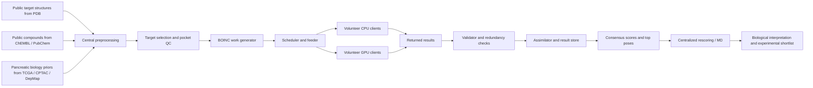
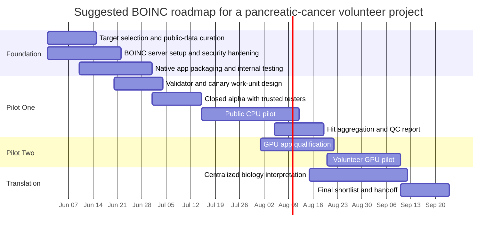

# Building a BOINC Volunteer-Computing Project for Pancreatic Cancer

## Executive summary

A BOINC project focused on pancreatic cancer is technically feasible, but the best first target is not raw patient omics or large-scale imaging. The strongest initial fit is **public-data, embarrassingly parallel structure-based computation**: docking, rescoring, pocket detection, and later-stage molecular dynamics on shortlisted hits. That recommendation is grounded in pancreatic ductal adenocarcinoma biology, where KRAS and the RAS-MAPK axis are dominant, in the wide public availability of structural data from the Protein Data Bank, and in the existence of mature open docking engines such as AutoDock Vina, AutoDock-GPU, and GNINA. PDAC is the dominant pancreatic cancer subtype, and KRAS alterations are present in roughly 93% of tumors in the NCI TCGA pancreatic ductal adenocarcinoma study. citeturn7search6turn25search11turn35view1turn22search5turn38search0

The most practical pilot is a **CPU-first BOINC virtual-screening project** using public PDB target structures and public compound libraries or subsets derived from ChEMBL and PubChem. Among the tools reviewed, **AutoDock Vina** is the best first production kernel because it is small, multithreaded, Apache-licensed, easy to validate, and easy to deploy natively without heavyweight dependencies. **AutoDock-GPU** and **GNINA** are the best second-wave accelerators for volunteers with capable GPUs, but they impose more driver, library, and validation complexity. **P2Rank** and **fpocket** are excellent support kernels for pocket triage and target preprocessing; **OpenMM** and **GROMACS** are valuable follow-on tools for refining hits, but are too expensive for a first public volunteer campaign unless the hit list is aggressively reduced first. citeturn9view0turn41search0turn20view0turn17view0turn17view1turn12search5turn11search5

By contrast, **TCGA-PAAD, CPTAC PDAC multi-omics, and image-heavy collections** are scientifically important but usually a poor first-wave BOINC fit. The reasons are operational as much as scientific: controlled-access human data require dbGaP-mediated authorization and NIH now expects controlled-access repositories and users to follow security standards; public volunteer endpoints are difficult to reconcile with those expectations. Even where data are public and de-identified, such as TCIA collections, file sizes and GPU-heavy deep-learning workflows make bandwidth, storage, and heterogeneity more problematic than public docking workloads. citeturn22search3turn31search0turn31search3turn25search0turn26search4turn25search3

BOINC itself is now flexible enough to support several deployment patterns: **native apps**, a **generic wrapper**, **VirtualBox VMs**, and newer **Docker/Podman and WSL wrappers**. BOINC also provides the validator, homogeneous-redundancy, adaptive-replication, checkpointing, code-signing, and sandbox mechanisms needed for scientific and operational rigor. Existing biomedical volunteer-computing projects such as **Rosetta@home**, **Docking@Home**, **World Community Grid/OpenPandemics**, and **GPUGRID** show that volunteer computing can handle protein modeling, docking, and GPU biomedical workloads when tasks are well-shaped and validation is carefully designed. citeturn32view0turn32view1turn32view2turn33search0turn33search1turn33search2turn40search2turn15search2turn34search1turn34search2turn34search4turn4search7

## Suitability and prioritization

For a pancreatic-cancer volunteer project, the decisive engineering question is not “what is scientifically interesting?” but “what computation can be safely distributed to heterogeneous, partially trusted volunteer endpoints with modest bandwidth and robust validation?” On that test, **docking and pocket detection dominate**. They use public inputs, decompose into independent work units, tolerate replication-based validation, and produce compact outputs. Public omics and imaging can still contribute, but mostly as **centralized curation, target selection, and downstream interpretation**, not as the first distributed kernel. citeturn35view0turn22search5turn38search0turn31search3turn26search4

### Top candidate stacks compared

| Stack | Primary use in pancreatic-cancer research | Scientific impact | BOINC feasibility | Resource profile | Privacy / regulatory profile | Recommended role | Sources |
|---|---|---|---|---|---|---|---|
| **AutoDock Vina + PDB + ChEMBL/PubChem subset** | Large-scale CPU virtual screening against KRAS-pathway or other PDAC targets | High | **Very high** | Low-memory CPU, small payloads, compact outputs | Very low if only public structures/compounds are used | **Best first pilot** | citeturn9view0turn9view4turn35view0turn22search5turn39search1turn7search6 |
| **AutoDock-GPU + PDB + PubChem/ChEMBL subset** | High-throughput GPU docking after target set is stable | High | High, but driver-sensitive | Moderate GPU, low output size | Very low with public data | Best second-wave accelerator | citeturn41search0turn41search1turn35view0turn39search1turn34search2 |
| **GNINA + curated hit set** | CNN rescoring / improved docking accuracy on narrowed libraries | High | Medium | GPU-preferred, heavier dependencies and model payloads | Very low with public data | Use after CPU burn-in and shortlist generation | citeturn20view0turn19search1turn35view0 |
| **P2Rank or fpocket + PDB** | Pocket discovery, target-site triage, rescoring support | Medium | **Very high** | Small CPU jobs | Very low | Support kernel for target prep and QC | citeturn17view0turn17view1turn35view0 |
| **OpenMM / GROMACS + shortlisted complexes** | MD refinement, stability filtering, mechanistic follow-up | Medium to high | Medium | GPU or long CPU jobs; heavier checkpointing needs | Very low with public structures/hits | Second or third phase only | citeturn12search5turn12search1turn11search4turn11search15turn42search2 |
| **Salmon + TCGA-PAAD open data** | Public RNA-seq quantification / reanalysis | Medium | Low to medium | CPU-friendly app, but large input files | Mixed; controlled human data are unsuitable for open volunteers | Centralized analysis, not first BOINC pilot | citeturn13search0turn13search4turn22search3turn31search3 |
| **MONAI + TCIA imaging** | Radiomics or imaging AI | Medium to high | Low for a first public campaign | GPU-heavy, large image payloads | Better than genomics if fully public/de-identified, but still operationally heavy | Later specialized project, or centralized first | citeturn14search0turn14search3turn26search4turn25search3 |

The practical implication is straightforward: **build the BOINC project around public structural biology and public chemistry first, then connect the resulting ranked hits back to pancreatic-cancer biology using centralized analysis of TCGA/CPTAC/DepMap and public imaging cohorts**. That sequencing minimizes regulatory exposure while still keeping the project biologically anchored in pancreatic cancer rather than generic docking. citeturn7search6turn22search3turn25search0turn24search0turn26search4

## Inventory of candidate computational tools

The table below uses **deployment-oriented estimates** for package size and volunteer work-unit resource use where official sources do not publish exact MB/GB footprints. Those estimates are intended for BOINC planning rather than software-forensics precision.

### Tool inventory

| Tool | Priority | Purpose | Typical inputs / outputs | Language | Dependencies | License | Size | Compute profile | Data privacy / regulatory concerns | Containerization | Sources |
|---|---|---|---|---|---|---|---|---|---|---|---|
| **AutoDock Vina** | **Very high** | Receptor-ligand docking and batch virtual screening | **In:** receptor and ligand `PDBQT`, config; can use external maps. **Out:** scored poses and logs in Vina/AutoDock-compatible formats | C++ with Python bindings | Native binary is light; Python bindings require `numpy`, `boost-cpp`, `swig`; ligand prep commonly via Meeko / AutoDock tools | Apache 2.0 | Small native package | CPU, multithreaded, low RAM; ideal 15–60 minute BOINC shards using batches of ligands | None if inputs are public structures and public compounds | **Easy**; native deployment strongly preferred | citeturn9view0turn9view4turn21search1turn21search9 |
| **AutoDock-GPU** | **High** | GPU-accelerated AutoDock4-style docking and screening | **In:** ligand file, grid maps, optional flexible residues, or AD4-style DPF. **Out:** docking results plus CPU analysis utilities for post-processing | C++ with CUDA / OpenCL paths | CUDA or OpenCL runtime and compatible drivers; GPU hardware qualification needed | GPL-2.0 and LGPL-2.1 files are present in the official repo | Medium | GPU-first; can also target CPUs/FPGAs through OpenCL variants; low output size, moderate runtime heterogeneity | None with public chemistry/structures | **Medium**; containerization is feasible but GPU passthrough and driver matching complicate it | citeturn41search0turn41search1turn41search8 |
| **GNINA** | **High** | Docking with integrated CNN scoring and pose optimization | **In:** protein-ligand files in formats supported by Open Babel. **Out:** docked poses and CNN/Vina-type scores | C++ / Python / CUDA | CUDA 12+, OpenBabel3, RDKit, Boost, protobuf, HDF5, Python stack; official prebuilt binary and Docker image available | Dual GPL / Apache; GPL is required when OpenBabel-linked | Large relative to Vina | CPU possible, but GPU strongly preferred for CNN scoring; more RAM/disk than Vina | None with public data | **Medium to high**; Docker is available, but volunteer GPU heterogeneity is the main issue | citeturn20view0turn19search1turn19search4 |
| **P2Rank** | **High support value** | ML binding-site prediction and downstream pocket rescoring | **In:** `PDB`, `mmCIF`, `BinaryCIF`, gzipped variants, dataset lists. **Out:** `predictions.csv`, `residues.csv`, visualization files, optional grids / descriptors | Java and Groovy | Java 17+; optional PyMOL / ChimeraX for visualization | MIT | Small | CPU, fast, multithreaded, minimal RAM; excellent preprocessing kernel | None | **Easy** | citeturn17view0turn18view0turn18view1 |
| **fpocket** | **High support value** | Geometric pocket detection and descriptors; `mdpocket` for ensembles | **In:** `PDB` / `mmCIF`; `mdpocket` can read `XTC`, `netcdf`, `dcd`. **Out:** pocket files, descriptors, and visualization aids | C | Compiler toolchain; newer versions use VMD molfile plugin and `netcdf` for some features | MIT | Small | CPU, light memory, excellent for target triage rather than heavy volunteer burn | None | **Easy**; official Docker image is documented | citeturn17view1turn16search3 |
| **OpenMM** | **Medium** | MD refinement and mechanistic follow-up on shortlisted hits | **In:** AMBER, GROMACS, CHARMM, Tinker, and application-layer simulation objects. **Out:** checkpoints, serialized states, trajectories via chosen reporters | Python, C, C++, Fortran bindings | CPU or GPU backends; CUDA, OpenCL, or HIP platforms available; plugins possible | MIT and LGPL | Medium to large | GPU-preferred for efficiency; moderate memory; checkpointing is built in but hardware-specific checkpoints are not portable | None with public structures and public ligands | **Medium**; good in Docker/Singularity for internal staging, but public GPU heterogeneity remains non-trivial | citeturn12search5turn12search1turn12search12turn12search15turn12search16 |
| **GROMACS** | **Medium** | Production MD and trajectory analysis | **In:** `topol.tpr` and related topology/coordinate inputs. **Out:** log, trajectory, final structure, checkpoint `.cpt`; resumable runs via checkpoints | Mainly C++/C in the public repo | Linux-first server side; CPU and multiple GPU acceleration paths; MPI/OpenMP depending build; checkpoint support via `mdrun` | LGPL v2.1 | Medium to large | CPU/GPU intensive; best for heavily down-selected complexes, not wide volunteer screening | None with public data | **Medium**; scientifically strong but heavier to operate than Vina/OpenMM for a volunteer pilot | citeturn11search4turn11search15turn42search0turn42search14turn42search2 |
| **Salmon** | **Low to medium for BOINC** | RNA-seq quantification of public PDAC cohorts | **In:** transcript `FASTA` and read `FASTQ/FASTA`, or `SAM/BAM` alignments. **Out:** sample quantification directories and `quant.sf` | C++11 | Reference transcriptome index; optional decoy strategy; alignment or quasi-mapping workflows | GPL v3 | Small code, but data-heavy workflows | CPU-friendly and memory-efficient, but raw RNA-seq inputs are large and bandwidth-heavy | Significant if human reads are controlled-access; public derived matrices are safer | **Easy** technically, but **poor first-wave BOINC fit** because of data movement and governance | citeturn13search0turn13search4turn13search13 |
| **MONAI** | **Low for a first BOINC pilot** | Medical imaging AI for segmentation, classification, radiomics pipelines | **In:** `NIfTI`, `DICOM`, `NRRD`, `PNG`, NumPy, etc. **Out:** tensors, segmentations, bundles, model artifacts | Python / PyTorch | PyTorch ecosystem; CPU or GPU stack; model bundles and optional deployment tooling | Apache 2.0 | Large | Usually GPU-heavy; high RAM and high disk for 3D or pathology workloads | Better than controlled genomics if public TCIA-only, but image governance and data volume still matter | **High containerization feasibility**, **lower BOINC practicality** for the first project | citeturn14search0turn14search1turn14search2turn14search3 |

A practical pancreatic-cancer workflow would almost certainly use a few additional glue tools that are not the main volunteer kernel. The most important example is **Meeko**, which the Forli lab documents as the preparer/converter for AutoDock Vina and AutoDock-GPU inputs and outputs, writing `PDBQT` inputs and exporting ligand results in `SDF` and receptor results in `PDB`. For BOINC architecture this matters because **ligand/receptor preparation should mostly happen centrally**, while volunteers execute the expensive but reproducible scoring kernel. citeturn21search9turn41search8

## Inventory of relevant public datasets

The next table separates **datasets that are ideal to distribute directly** from datasets that are best used centrally for task design, validation, biological interpretation, or public-only derivative artifacts.

### Dataset inventory

| Dataset | Priority | Purpose in a pancreatic-cancer BOINC project | Formats / interfaces | Programming language / dependencies | License / access | Size | Typical downstream compute profile | Data privacy / regulatory concerns | Ease of use in containers / BOINC | Sources |
|---|---|---|---|---|---|---|---|---|---|---|
| **RCSB PDB / wwPDB target structures** | **Very high** | Public structural targets for KRAS-pathway proteins and other actionable PDAC biology | `PDBx/mmCIF`, `BinaryCIF`, XML, legacy PDB for some entries | N/A; standard structure parsers and docking prep tools | CC0 public-domain dedication for archive data and APIs | Full 2025 legacy archive snapshot: **1,583 GB**; project-specific target panels are tiny by comparison | Ideal for BOINC; per-task target payloads can be MB-scale | None | **Excellent**; cache or embed once, then reuse across millions of work units | citeturn35view0turn35view2turn37search0turn37search7 |
| **ChEMBL** | **Very high** | Public bioactive chemistry source for initial or repurposing-focused screening libraries | Curated database/API resource; official ecosystem includes release packaging such as SQLite in recent historical distributions | N/A; local SQLite / ETL tooling commonly used | CC BY-SA 3.0 for data content | Large full release; best practice is to prefilter and shard for BOINC | Excellent for ligand sharding and target-focused subsets | None | **Excellent** after central curation; volunteers should receive only small shards, not the whole database | citeturn35view3turn35view4turn23search0 |
| **PubChem** | **Very high** | Huge openly accessible chemistry source for expanded screening and public bioassay context | Official downloads support CSV, JSON, JSONL, XML, RDF; record-level chemistry and source metadata are programmatically accessible | N/A; ETL and curation tooling needed | Open / freely accessible archive; licensing/provenance considerations can vary by contributing source and are surfaced in source metadata | Massive bulk resource; central filtering and sharding are required | Useful as chemistry feeder data, not as a monolithic volunteer payload | Low for chemistry-only use; check provenance if redistributing annotations from third-party contributors | **Good only after aggressive central filtering** | citeturn39search4turn39search1turn39search12turn38search0 |
| **TCGA-PAAD via GDC** | **Medium as centralized support** | Public pancreatic adenocarcinoma genomics/clinical cohort for target selection, biomarker hypotheses, and post-screen interpretation | Harmonized clinical and genomic data in GDC; project includes **185 cases** and **12,853 files** | N/A; genomics workflows require specialized readers/pipelines | Open plus controlled tiers; controlled data require dbGaP/eRA access | Large project; public gene-level matrices are manageable, raw sequence files are not | Good for centralized analysis; poor fit for broad volunteer distribution | **High** for controlled human data; NIH expects controlled-access repositories and secure user handling | Not recommended as raw volunteer payload; only derived non-identifiable tasks should ever be distributed | citeturn22search3turn31search0turn31search1turn31search3 |
| **CPTAC PDAC via PDC / GDC** | **Medium as centralized support** | Proteogenomic anchor for pancreatic tumors, useful for pathway prioritization and biological triage of hits | Harmonized proteomic outputs through PDC/CDAP; linked genomic data via GDC | N/A; proteomics and multi-omics analysis tooling required | Mixed public and protected access depending data class | PDC overall currently reports **70 TB** across its holdings; the pancreatic subset is smaller but still non-trivial | Best for centralized pathway analysis and benchmarking, not first-wave BOINC | Moderate to high depending file class and linkage | Derived public matrices are usable centrally; raw or protected data should not be sent to volunteers | citeturn25search0turn25search4turn25search11 |
| **DepMap 24Q2 Public** | **Medium** | Cell-line omics and CRISPR dependencies for pancreatic-line target prioritization and hit interpretation | Public release contains WGS/WES-derived copy number and mutation, RNA-seq expression/fusions, CRISPR knockout screens, and metadata | N/A; matrix-analysis toolchains required | CC BY 4.0; depositor states no human PII in files or description | **23.31 GB** for the 24Q2 public package | Moderate CPU / memory for dependency modeling and permutation analyses | Low relative to patient cohorts | Good for centralized or limited distributed tasks; less attractive than docking as a flagship BOINC workload | citeturn24search0turn36view0turn35view7 |
| **TCIA Pancreas-CT** | **Low to medium for BOINC** | Public pancreas anatomy / segmentation reference data, useful for imaging pilots and pipeline prototyping | De-identified DICOM converted from anonymized volumetric images; manual pancreas segmentations available | N/A; medical image readers and preprocessing stacks required | Public TCIA-style access to de-identified data | 82 abdominal CT scans; per-case image payloads are materially larger than docking tasks | Imaging inference/training is much heavier than docking and often GPU-bound | Low to moderate; public and de-identified, but still clinical imaging | Reasonable for centralized prototyping; not the best first public volunteer workload | citeturn26search0turn26search4 |
| **TCIA CPTAC-PDA imaging** | **Low to medium for BOINC** | De-identified radiology and pathology images from the CPTAC pancreatic ductal adenocarcinoma cohort, useful for radiomics/pathomics follow-up | Radiology and pathology image collections linked to the CPTAC PDA cohort | N/A; imaging and pathology pipelines required | Public de-identified TCIA collection | Large and image-heavy; practical work units would need aggressive tiling/caching | GPU-heavy or storage-heavy depending task design | Lower than controlled omics, but still substantial operational complexity | Better as a later, specialized imaging project than as the first BOINC deployment | citeturn25search3turn26search1turn26search4 |

For governance, the cleanest boundary is this: **only distribute public chemistry, public structures, and public non-human or non-identifiable derivatives to volunteers**. Use TCGA/CPTAC/DepMap/TCIA centrally to choose targets, rank candidates, and interpret biology. That design preserves pancreatic-cancer specificity without pushing sensitive or operationally expensive data to anonymous endpoints. citeturn31search3turn22search3turn25search0turn24search0turn26search4

## BOINC architecture and implementation

BOINC can host this project in several ways. For pancreatic-cancer docking, the default recommendation is **native BOINC applications** for Vina, P2Rank, and fpocket, with **Docker/Podman** reserved for more complex stacks and **VirtualBox** used only when strict environment encapsulation is worth the payload overhead. BOINC’s current documentation explicitly supports Docker apps through `docker_wrapper`, supports WSL-mediated execution on Windows, and continues to support VM-based apps via `vboxwrapper`. BOINC project creation is Linux-centric, with a MySQL database, project directory, project configuration file, Apache integration, and `make_project`-based setup. citeturn32view0turn32view1turn32view2turn32view4turn32view5

### BOINC-compatible frameworks and middleware

| Framework / middleware | Best use | Strengths | Main caveats | Recommendation for this project | Sources |
|---|---|---|---|---|---|
| **Native BOINC app** | Vina, P2Rank, fpocket | Small downloads, simplest validation, fastest startup, easiest volunteer UX | Requires per-platform builds and careful dependency control | **Default choice for Pilot One** | citeturn32view4turn32view5 |
| **BOINC wrapper** | Non-BOINC-aware command-line programs | Lets existing programs run under BOINC without deep app rewrites | Less elegant than full integration; still need robust I/O control | Good for first internal prototypes | citeturn1search11 |
| **Docker wrapper / Podman** | GNINA, complex Python stacks, reproducible internal deployments | Great environment reproducibility; optional GPU access; BOINC now documents `docker_wrapper` and Podman support | Larger payloads, WSL/Podman/Docker prerequisites, more volunteer friction | Use selectively for Phase Two or internal staging, not for the initial public CPU pilot | citeturn32view0turn32view1turn32view3 |
| **WSL wrapper** | Windows-specific Linux runtime bridging | Useful for Windows environments where Linux-oriented payloads are easier to maintain | WSL friction and Windows operational complexity | Secondary option, mainly for Docker-enabled Windows volunteers | citeturn32view2 |
| **vboxwrapper / VirtualBox** | Isolation of difficult software stacks | Stronger environment isolation | Heavy images and slower volunteer adoption | Reserve for exceptional cases only | citeturn0search1 |

### Existing biomedical BOINC precedents

Rosetta@home shows that **protein-structure and design workloads can sustain a long-running community volunteer project**. Docking@Home demonstrates that **protein-ligand docking specifically has already been operationalized on BOINC**. World Community Grid’s OpenPandemics work is particularly relevant because a WCG article notes that large-scale volunteer docking helped motivate features added to **AutoDock-GPU**. GPUGRID provides a precedent for **GPU-centric biomedical volunteer workloads**, although it also illustrates the additional operational burden of GPU qualification. citeturn15search2turn34search1turn34search2turn4search7turn34search4

### Data and task flow

### Technical integration steps

A high-confidence deployment sequence is:

**Server creation and app packaging.** Create the BOINC project on Linux using the documented MySQL/Apache/project-directory layout, initialize with `make_project`, and protect the ops interface. Build the first science payload as a native BOINC-compatible binary or simplest wrapper-based command-line app. For a Vina pilot, package only the binary, small receptor assets, and ligand shards; do not ship a heavyweight container unless you absolutely need one. citeturn32view4turn32view5

**Task generation.** Centrally preprocess receptor structures and ligands, then create work units containing a target structure identifier, docking box parameters, ligand shard, seed, and expected output schema. Keep work units **short and numerous**, because volunteer hosts are heterogeneous and some will be unreliable or intermittent. BOINC’s work generators, templates, validators, and assimilators are designed around exactly this kind of job decomposition. citeturn33search13turn33search5turn33search2

**Result validation.** Start with **replication-based quorum validation** at low scale, then move toward **adaptive replication** as reliable hosts emerge. If floating-point differences matter, use **homogeneous redundancy** so equivalent hosts validate against each other. For docking, a robust validator should not rely only on file existence. It should parse output syntax, confirm ligand IDs and counts, enforce reasonable score ranges, and compare scores or hashable canonicalized outputs within tolerance. BOINC’s standard and custom validator framework supports this. citeturn33search0turn33search1turn33search2turn33search12

**Checkpointing.** BOINC applications can use the BOINC API checkpoint mechanisms (`boinc_time_to_checkpoint()` and `boinc_checkpoint_completed()`), while MD engines such as GROMACS and OpenMM already support tool-level checkpoint files. In practice, docking work units should be short enough that checkpointing is simple: save progress every N ligands within the shard and return partial state cleanly on suspend/resume. For MD follow-on projects, native engine checkpoint files are essential. citeturn3search1turn11search4turn12search1turn12search12

**Security.** BOINC’s most important project-side controls are **code signing**, **secure handling of private signing keys**, **upload authentication**, **output-size limits**, and **sandboxing**. BOINC documentation explicitly frames code signing as the defense against malicious executable distribution if a server is compromised, and it documents account-based sandboxing on unprivileged accounts, plus stronger VM/container isolation when needed. For this project, the signing key should live offline on a dedicated code-signing machine, and every release should be promoted through a canary tier before broad volunteer exposure. citeturn40search2turn40search6turn40search7turn40search15turn40search1

**Volunteer client requirements.** A plain native CPU pilot has the lowest barrier: standard BOINC client, modest disk, and no special drivers. Docker-based apps require BOINC support for Docker plus Podman or Docker on the volunteer machine; the current BOINC Docker cookbook notes BOINC 9.0+ for Docker jobs and, on Windows, WSL prerequisites. GPU pilots require explicit hardware support matrices and stricter host qualification than CPU pilots. citeturn32view1turn32view3turn34search4

## Recommended pilots and roadmap

The recommended program is **two-stage**. Stage one should prove community operations, validation correctness, and pancreatic-cancer scientific framing with a CPU-native public-data workload. Stage two should increase throughput or accuracy with volunteer GPUs after the server, validator, and community support processes are already stable.

### Recommended pilot projects

| Pilot | Objective | Toolchain | Public data inputs | Estimated compute budget | Volunteer scale | Estimated timeline | Success criteria | Sources |
|---|---|---|---|---|---|---|---|---|
| **Pilot One: KRAS-focused CPU virtual screening** | Launch a public BOINC project around a clearly pancreatic-cancer-relevant target panel, prove validator correctness, and generate a ranked shortlist | P2Rank/fpocket for pocket QC, Meeko for prep, **AutoDock Vina** as the volunteer kernel | PDB target structures; curated ChEMBL/PubChem subset | **Validation tranche:** ~5,000 CPU-hours for 50k ligands × 2 targets with quorum-2 burn-in. **Production tranche:** ~25,000–35,000 CPU-hours for 250k ligands × 3 targets, including replication/retries. These are engineering estimates. | About **300–1,000 CPU volunteers**; at ~3,000 donated core-hours/day, the production tranche is roughly **one to two weeks** of wall time | **Eight to twelve weeks** from server bootstrap to final ranked set | Stable quorum behavior, <5% invalid-return rate after burn-in, reproducible rank-order on canary ligands, and a top ~0.1–1% hit list suitable for follow-up | citeturn7search6turn9view0turn17view0turn17view1turn35view0turn22search5turn39search1turn21search9 |
| **Pilot Two: GPU rescoring / fast follow-up** | Improve throughput or scoring fidelity on the top hit set after Pilot One proves operations | **AutoDock-GPU** for fast redocking, or **GNINA** for CNN rescoring on narrowed libraries | Same PDB targets; top 10k–20k ligands from Pilot One | Roughly **500–1,000 GPU-hours** for a narrowed hit set across 2–3 receptor states. Engineering estimate. | **50–150 GPU volunteers** is enough for a short campaign | **Four to eight weeks** after Pilot One | Agreement between GPU phase and CPU shortlist enrichment, robust GPU host qualification, and a lab-ready final shortlist | citeturn41search0turn20view0turn35view0 |
| **Pilot Three: Centralized biology interpretation** | Connect docking hits back to pancreatic biology without exposing sensitive or operationally heavy data to volunteers | Centralized downstream analysis using DepMap, TCGA-PAAD open data, and CPTAC public outputs; optional OpenMM/GROMACS on the most promising complexes | DepMap public release, GDC open PAAD views, CPTAC public outputs | Not a BOINC compute budget; modest internal compute is enough until MD follow-up | Internal cluster or cloud | In parallel with Pilot Two | Produce target/pathway rationale, line-of-evidence report, and candidate prioritization for wet-lab review | citeturn24search0turn36view0turn22search3turn25search0turn12search5turn11search5 |

### Recommended roadmap

### Open questions and limitations

The deepest unresolved issue is **target-panel choice**. A purely KRAS-centered project is biologically defensible because KRAS dominates PDAC genomics, but a richer panel may improve translational value by including pathway partners, vulnerability targets from DepMap, or targets supported by CPTAC dysregulation. That choice should be made centrally before public launch. citeturn7search6turn24search0turn25search11

The second limitation is **benchmark calibration**. Official sources document capabilities, interfaces, and licensing, but they do not publish uniform volunteer-grade runtime and memory benchmarks for your exact receptor, ligand library, and exhaustiveness settings. The compute budgets above are therefore engineering estimates, not vendor guarantees.

The third limitation is **human-data governance**. Although public de-identified cohorts are available, any move toward controlled-access genomic or imaging data would require a governance model very different from an open, anonymous volunteer platform. For that reason, the most rigorous architecture is a **hybrid model**: public structural chemistry on BOINC, controlled or heavy human data kept centralized. citeturn31search3turn22search3turn25search0turn26search4

The analytically strongest conclusion is that a pancreatic-cancer BOINC project should begin as a **public-data, CPU-native docking platform with pancreatic-specific target selection**, then layer in **GPU rescoring** and **centralized omics interpretation**. That path maximizes feasibility, minimizes regulatory and security risk, and still produces outputs that are meaningfully tied to pancreatic-cancer biology rather than generic compute demonstration. citeturn7search6turn9view0turn41search0turn20view0turn31search3turn32view0