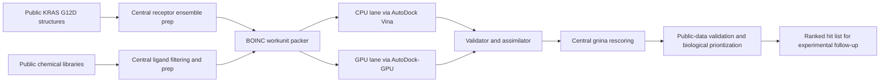
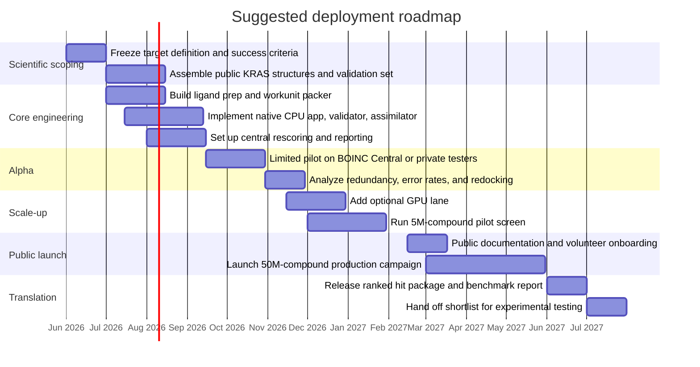

# BOINC Distributed Computing for Pancreatic Cancer

## Executive summary

For a new BOINC project focused on pancreatic cancer, the single best computational target is **ensemble virtual screening for small molecules that bind the switch-II pocket of GDP-bound KRAS G12D**. That choice dominates the alternatives because it combines the strongest disease relevance in pancreatic ductal adenocarcinoma (PDAC), the cleanest fit to volunteer computing, and the most credible validation path using public data. In TCGA’s PDAC study, **KRAS was mutated in 93% of tumors**, and the NCI notes that **KRAS G12D is the most common specific KRAS mutation in pancreatic cancer**, present in about **35%** of diagnosed cases. Public structures now show the pocket is chemically tractable, including **7RPZ**, a high-resolution KRAS G12D–MRTX1133 complex, and related KRAS G12D structures that define usable docking pockets. citeturn21view2turn21view4turn21view6

From a BOINC standpoint, this target is unusually well matched to the platform. BOINC is best for **high-throughput, loosely coupled jobs** with **small input/output relative to compute**, modest memory, and adjustable task sizes; it is explicitly less suited to workloads with **extreme memory or storage requirements** or very high communication overhead. BOINC also provides the primitives needed for a volunteer docking pipeline: **multiple app versions and plan classes for heterogeneous CPUs/GPUs**, **checkpoint/restart**, **custom validation**, **homogeneous redundancy**, **sticky files/locality scheduling**, and **code signing**. Meanwhile, docking software is mature and open: **AutoDock Vina** is a widely used CPU engine with batch-mode virtual screening, **AutoDock-GPU** provides batched GPU screening with reported large speedups over serial AD4, and **gnina** improves pose prediction when used as a secondary rescoring step. citeturn34view0turn31view1turn17view0turn17view3turn31view2turn18view0turn18view2turn24view2turn27view0turn24view1

The right project architecture is therefore a **funnel**, not a monolith: central curation and receptor preparation, BOINC for the large embarrassingly parallel screening layer, and centralized rescoring and biological prioritization for the top fraction of compounds. This keeps the volunteer side simple, reproducible, and secure while preserving scientific rigor. The most pragmatic launch path is a **pilot on BOINC Central**, which openly states that it lets scientists use volunteer computing without running a full project and, as of March 2026, supports **Docker-packaged applications** and **AutoDock**; once the method is stable, a dedicated public BOINC deployment becomes justified. citeturn35view0turn17view4

The central scientific limitation is also clear: a BOINC virtual screening project can accelerate **early hit discovery**, but it cannot by itself establish clinical value. The public-data validation plan can robustly establish **retrospective performance**, **structural plausibility**, and **orthogonal biological relevance**, but **prospective wet-lab testing** remains the decisive next step. That said, among the candidate domains requested, no other area gives a comparable mix of **impact, deployment realism, and public-data validation quality**. citeturn32view0turn37view0turn20view5turn20view6turn20view2turn20view3

## Comparative assessment of candidate domains

The comparison below is a synthesis from BOINC’s own workload constraints and representative pancreatic-cancer public resources. BOINC favors jobs that are high-throughput, loosely coupled, modest in memory/storage, low in communication, and roughly hour-scale in runtime; that favors docking-style screening and disfavors raw genomics, whole-slide pathology, and large integrated single-cell workflows. Public PDAC resources are also uneven: structural/bioactivity resources for docking are mature, while some genomics resources remain controlled-access and image or single-cell workloads are heavier and more annotation-dependent. citeturn34view0turn31view1turn21view2turn22search2turn33view4turn33view0

| Domain | Impact in pancreatic cancer | BOINC suitability | Compute profile | Data needs | Validation difficulty | Bottom-line assessment |
|---|---|---:|---|---|---|---|
| **Molecular docking** | Moderate as a **kernel**, but not enough by itself as a project | **Very high** | Independent pose/scoring jobs; CPU/GPU friendly; low I/O | Public structures and ligands are abundant | **Low to medium** for pose reproduction | Excellent internal primitive, but too narrow as the project’s primary scientific objective |
| **Virtual screening** | **Very high** if focused on KRAS G12D | **Very high** | Massive embarrassingly parallel batch jobs; perfect BOINC funnel stage | Public structure, chemical, and orthogonal cancer datasets exist | **Medium** | **Best overall choice** |
| **Protein folding** | Lower marginal value now that public structure prediction resources are mature | High technically | Long jobs; often GPU-heavy; variable outputs | Structure data are public | **High** for pancreatic-specific impact | Scientifically interesting, but weak as a first PDAC-specific BOINC project |
| **Genomics / variant analysis** | High biological value | Low to medium | Large BAM/CRAM inputs, significant memory and storage, privacy concerns | TCGA/GDC data useful but some raw data are controlled | **Medium** | Better on institutional/cloud compute than on public volunteer endpoints |
| **Histopathology image analysis** | High translational/clinical value | Low | Very large whole-slide images; central GPU training is usual | Public pathology images exist, but datasets are huge | **Medium to high** | Valuable science, poor BOINC fit unless restricted to very specific inference tasks |
| **Single-cell RNA-seq** | High mechanistic value | Low to medium | Sparse-matrix integration, batch correction, permutations; memory-heavy | Public PDAC atlases exist | **High** | Better as centralized HPC/cloud analysis than volunteer computing |
| **Network / pathway simulations** | Moderate to high for hypothesis generation | Medium to high | Parameter sweeps are BOINC-friendly; modest I/O | Can use public omics/dependency data | **High** because ground truth is indirect | Good **second-generation** BOINC project, not the strongest first one |

The ranking is driven by three facts. First, **KRAS-centered biology is unusually dominant in PDAC**, so a direct KRAS target has better disease centrality than most alternatives. Second, **virtual screening maps directly onto BOINC’s strengths**, whereas BOINC itself warns that volunteer computing is less suited to workloads with extreme memory/storage or very high communication. Third, public validation assets for docking are unusually strong: **RCSB PDB and wwPDB** for structural truth, **ChEMBL, BindingDB, and PubChem BioAssay** for ligand activity data, **DUD-E** for classical docking calibration, and orthogonal cancer resources such as **TCGA/GDC, CPTAC, DepMap, and PRISM** for biological plausibility. By contrast, **AlphaFold DB already provides over 200 million structures**, reducing the marginal value of a new volunteer folding project, while public pathology and single-cell resources are large enough to be awkward on heterogeneous volunteer machines. citeturn21view2turn21view4turn34view0turn20view4turn37view0turn20view5turn5search10turn6search3turn20view7turn22search2turn22search3turn20view2turn38view0turn20view10turn33view4turn33view0

## Recommended target

The recommended target is:

**A BOINC-enabled ensemble virtual screening campaign for direct binders of the switch-II pocket of GDP-bound KRAS G12D in pancreatic ductal adenocarcinoma.**

This is the right level of specificity. “Pancreatic cancer virtual screening” is too broad to validate rigorously, and “molecular docking” is too narrow to justify a whole public project. A **single, biologically central, structurally tractable, benchmarkable target** makes the science clearer, the public message easier, and the engineering simpler. KRAS G12D satisfies all three conditions. The NCI’s TCGA PDAC page identifies KRAS and the RAS–MAPK pathway as central to PDAC, with KRAS altered in 93% of the study cohort; the NCI’s pancreatic KRAS article further states that **KRAS G12D is the most common specific mutation** in pancreatic cancer. Public structural evidence is unusually favorable: **7RPZ** directly captures KRAS G12D with **MRTX1133**, and **6GJ7** demonstrates druggability of a KRAS G12D pocket with a distinct ligand class. citeturn21view2turn21view4turn21view6turn21view7

The strongest justification is not only biological centrality but **public ground truth**. The MRTX1133 preclinical program established that potent, selective, non-covalent KRAS G12D inhibition is possible and showed marked tumor regression in multiple KRAS G12D models, including pancreatic models. That means a BOINC project is not trying to open an entirely hypothetical target class; it is trying to discover **additional chemotypes** against a now-validated binding concept. In practice, that makes validation far more defensible than for a network-simulation project or a pathology model trained on sparse, noisy labels. citeturn32view0turn21view4

There is also a methodological reason to prefer a **pocket-defined screening campaign** over whole-protein or blind docking. The gnina paper reports that docking accuracy improves when the binding pocket is explicitly defined, with better Top1 redocking and cross-docking performance than broader search modes. For a volunteer pipeline, that matters twice: it improves scientific signal and keeps work units smaller and more uniform. citeturn24view1

A useful mental model is this:

A final strategic point: even though KRAS G12D is the right first target, the project should **not overpromise single-agent cure logic**. The MRTX1133 literature shows bypass and feedback biology still matter, including improved activity from co-targeting EGFR or PI3Kα. That does not weaken the case for a KRAS G12D screening project; it means the BOINC project should be framed as **hit generation for the most central driver**, with combination strategies reserved for later phases. citeturn32view0

## Technical plan for BOINC integration

The most robust design is a **three-tier architecture**. Tier one is central preparation: receptor structures, pocket definitions, ligand protonation/tautomer handling, and complexity bucketing. Tier two is BOINC execution: thousands to hundreds of thousands of small, independent screening work units. Tier three is central postprocessing: rescoring, deduplication, activity-data joins, and hit prioritization. This matches BOINC’s own model of staged files, apps, validators, assimilators, and efficient dispatch. BOINC servers can dispatch **hundreds of jobs per second even on a single machine**, so the operational bottleneck is more likely to be method curation and postprocessing than scheduler throughput. citeturn17view4turn31view0

For software, the cleanest baseline stack is:

| Layer | Recommended choice | Why this is the right default |
|---|---|---|
| Receptor curation | **RCSB PDB + wwPDB validation reports** | High-quality public structures with public validation metadata citeturn20view4turn37view0 |
| Ligand library | **ZINC20 / ZINC-derived subsets** | Public ultralarge chemical space suitable for virtual screening citeturn23search6turn23search2 |
| Ligand/receptor preparation | **RDKit + Meeko** | RDKit is a standard open cheminformatics toolkit; Meeko prepares input for Vina and AutoDock-GPU and exports results cleanly citeturn28search0turn24view3 |
| CPU docking lane | **AutoDock Vina 1.2.x** | Widely used, fast, batch-oriented, open source, and easy to port natively across desktop platforms citeturn24view2turn27view2 |
| GPU docking lane | **AutoDock-GPU** | Batched ligand pipeline, OpenCL/CUDA support, reported speedups over serial AD4 citeturn27view0 |
| Secondary rescoring | **gnina** | Better pose-quality metrics than plain Vina for pocket-defined tasks; keep this centralized to avoid client complexity citeturn24view1turn27view1 |
| Orchestration | **Nextflow + Docker or Apptainer** on the server side | Reproducible central workflows with container support; use containers centrally even if clients run native binaries citeturn28search1turn28search2turn28search9 |
| Pilot hosting path | **BOINC Central** | Fastest low-ops pilot path; BOINC Central explicitly supports Docker-packaged apps and AutoDock citeturn35view0 |

The key design recommendation on **containerization** is to separate **scientific reproducibility** from **client delivery**. Use containers aggressively in central preprocessing, postprocessing, and CI. But for public volunteers, prefer **native signed binaries** for Windows, Linux, and macOS, because BOINC’s native app model is simpler and lower-friction than requiring VirtualBox. BOINC does support VM and Docker-style workloads through a VirtualBox-based path, and its own paper notes that VM technology provides strong sandboxing and application-independent checkpoint/restart. But the BOINC VirtualBox cookbook also shows that VM-based deployment can involve a **large VM image download**—the example uses a **1.9 GB** image—which is unattractive for broad volunteer adoption. Native first, VM fallback second, is the right order. citeturn19view2turn17view1

### Task design

Work units should be built around **runtime uniformity**, not just compound count. BOINC recommends targeting jobs to about **an hour** in runtime and provides job-size mechanisms for heterogeneous hosts. In practice, the screen packer should therefore bucket ligands by proxies for docking cost—at minimum **heavy-atom count, rotatable bonds, and protonation-state count**—and then assemble work units to a target wall time rather than a fixed number of molecules. citeturn31view1turn19view1

A good initial design is:

| Work unit type | Payload concept | Suggested wall-time target | Return payload |
|---|---|---|---|
| CPU alpha | One receptor conformer + a bucketed ligand batch | 30–90 minutes | Best score per ligand, one best pose only for compounds passing a threshold |
| GPU beta | One receptor conformer + a larger ligand batch | 10–30 minutes | Same schema, but larger ligand batch |
| Redundancy canary | Same as above, intentionally replicated | Same as lane target | Used to measure numerical consistency and host trust |

Checkpointing should happen **between ligand evaluations**, not inside a single docking trajectory. BOINC supports application-level checkpointing, and the wrapper can monitor a declared `checkpoint_filename` and `fraction_done_filename`. That makes the simplest implementation a ligand-batch worker that appends progress to a state file after every *N* ligands, updates a fraction-done file, and flushes recoverable partial output periodically. citeturn18view0turn17view0

Use **sticky files** aggressively. Receptor grids, conformer bundles, and common lookup assets should be versioned and cached on volunteer hosts so they are downloaded once and then reused. BOINC’s sticky-file and locality-scheduling mechanisms exist precisely for workloads where large inputs are shared across many jobs. For docking, that means the recurring network cost should be mostly ligand batches and small result files, not repeated receptor bundles. citeturn31view2

### Validation, security, and client trust

Because volunteer hosts are explicitly **anonymous, untrusted, and heterogeneous**, result validation cannot be an afterthought. BOINC provides three relevant mechanisms: **replication-based validation**, **homogeneous redundancy**, and **adaptive replication**. The right configuration for this project is to start conservatively—replicate a meaningful fraction of jobs, use **plan-class-specific validators**, and avoid cross-comparing outputs from heterogeneous CPU and GPU lanes until you have empirical evidence of numerical equivalence. BOINC’s own documentation recommends **custom validators** when outputs require tolerance-aware comparison rather than bytewise identity. citeturn34view0turn31view0turn17view3turn31view3

For screening jobs, the validator should compare:

- ligand identifiers and receptor version IDs exactly,
- docking metadata exactly,
- score vectors within explicit tolerance windows,
- pose hashes or contact fingerprints within an allowed equivalence threshold.

Once a host–app-version pair has built a clean validation history, BOINC’s adaptive replication can reduce the throughput penalty. BOINC notes that adaptive replication tracks trust at the **(host, app version)** level and can move the overhead close to one instead of a full factor-of-two replication penalty. citeturn31view3

For application security, rely on BOINC’s **code-signing model** and follow its strongest recommendation: keep the signing key on an offline, physically secured machine. BOINC’s file model is immutable and code-signed app versions are explicitly intended to prevent compromised servers from turning volunteer hosts into malware delivery systems. Also limit upload size with BOINC’s tokenized upload protections, restrict outputs to numeric text plus optional pose files, and never execute user-supplied code paths on the server. citeturn18view2turn18view4

### Resource needs and client requirements

The table below is an **illustrative sizing model**, not a benchmark claim. It assumes three receptor conformers, **500 ligands per CPU work unit**, **5,000 ligands per GPU work unit**, and approximately **5 MB input / 0.5 MB output** per CPU work unit or **20 MB input / 1 MB output** per GPU work unit after compression and sticky-file reuse.

| Screening scale | Docking evaluations | CPU work units | GPU work units | Approximate transfer volume | Intended purpose |
|---|---:|---:|---:|---:|---|
| **Pilot**: 5 million compounds | 15 million | 30,000 | 3,000 | ~150 GB CPU-input scale or ~60 GB GPU-input scale, with outputs an order of magnitude smaller | Methods validation and first public run |
| **Expansion**: 50 million compounds | 150 million | 300,000 | 30,000 | ~1.5 TB CPU-input scale or ~0.6 TB GPU-input scale | Serious hit-discovery campaign |

These estimates are realistic for BOINC precisely because the per-task data footprint is small compared with the amount of floating-point work, which is the communication-to-compute ratio BOINC prefers. They also show why **native client caching** and **small return payloads** matter: the network is manageable only if receptor/common files are sticky and volunteers return mostly ranking metadata rather than dense multi-pose archives for every ligand. citeturn34view0turn31view2

Recommended volunteer requirements should be conservative:

| Client lane | Recommended minimum | Recommended target |
|---|---|---|
| **CPU native** | 64-bit Windows/Linux/macOS, 4 GB RAM, ~2 GB free disk | 8 GB RAM, multi-core CPU, stable internet |
| **GPU optional** | 64-bit Windows/Linux, 8 GB RAM, current OpenCL/CUDA-capable GPU, ~2 GB free disk | 4+ GB VRAM, modern drivers, dedicated cooling |
| **VM fallback** | VirtualBox installed, 8 GB RAM, larger disk allowance | Use only if native ports are infeasible |

This hardware mix matches BOINC’s support for multiple platforms and plan classes and the docking tools’ split between CPU and GPU engines. BOINC also exposes memory, disk, and throttling preferences to volunteers, so the project should be robust to partial utilization and should never assume uninterrupted full-time execution. citeturn34view1turn19view1turn27view0turn24view2

## Validation with public data

Validation should be run as a **four-layer ladder**, because no single metric is enough.

The first layer is **structural truth**. Start with public KRAS G12D structures from **RCSB PDB**, and only use structures with strong **wwPDB validation reports**. The minimum benchmark set should include **7RPZ** because it is the most directly relevant KRAS G12D small-molecule complex, plus at least one orthogonal KRAS G12D pocket structure such as **6GJ7**. The structural validation task is straightforward: redock the crystallographic ligand into the prepared receptor, record pose RMSD and key-contact recovery, and reject receptor-prep settings that cannot recover the known pose. citeturn21view6turn21view7turn37view0

The second layer is **retrospective ligand discrimination**. Build a KRAS-focused gold-standard set from **ChEMBL**, **BindingDB**, and **PubChem BioAssay**, prioritizing assay-context-matched biochemical measurements for KRAS G12D or closely related switch-pocket binders. ChEMBL is a curated drug-like bioactivity resource; BindingDB is a public resource of experimentally measured protein–small-molecule affinities; PubChem BioAssay adds tested-active and tested-inactive screening data. For the project, these databases should be curated into **confirmed actives**, **assay-matched inactives**, and **unknowns**—never treat “not reported” as inactive. citeturn20view5turn5search14turn6search3

The third layer is **benchmark calibration**, but this should be used cautiously. **DUD-E** remains useful for traditional docking-pipeline calibration because it ships actives plus property-matched decoys for 102 targets, but it is not a KRAS-specific proof set. **LIT-PCBA** was originally attractive because it drew actives and inactives from PubChem BioAssays, but a 2025 audit reported severe data leakage and redundancy and argued that the benchmark is unreliable for fair evaluation in its present form. So the right policy is: use DUD-E only for **engine/pipeline sanity checks**, and treat LIT-PCBA as a **historical secondary benchmark with explicit caveats**, not as decisive evidence of screening quality. citeturn20view7turn20view8turn36view1

The fourth layer is **orthogonal biological relevance**. A ranked chemical list is stronger if it remains plausible when joined to PDAC public biology. Use **TCGA-PAAD** and the NCI PDAC study for mutation prevalence and subtype context, **CPTAC PDAC** for proteogenomic context, **DepMap** for model-level dependency structure, **PRISM** for drug-response context when a hit or close analog already exists in public compound screens, and **TCGA\_DEPMAP**-style translational resources when patient relevance needs an extra layer. This does not prove binding, but it dramatically improves target prioritization and deprioritizes compounds whose apparent docking signal is biologically implausible. citeturn22search2turn21view2turn22search1turn22search3turn20view2turn20view3turn39view0turn39view1turn38view0

A practical validation asset table is below.

| Resource | Use in this project | Why it matters |
|---|---|---|
| **RCSB PDB** and **wwPDB validation reports** citeturn20view4turn37view0 | Structure selection, pocket definition, redocking ground truth | Primary structural truth and quality control |
| **7RPZ** KRAS G12D–MRTX1133 citeturn21view6 | Core pocket benchmark | Directly relevant co-crystal for the target pocket |
| **6GJ7** KRAS G12D pocket structure citeturn21view7 | Orthogonal pocket/conformation support | Guards against overfitting to one receptor state |
| **ChEMBL** citeturn20view5 | Curated actives and SAR around KRAS-related chemistry | Public medicinal-chemistry ground truth |
| **BindingDB** citeturn5search10turn20view6 | Affinity measurements and patents/SAR follow-up | Additional public activity evidence |
| **PubChem BioAssay** citeturn6search3 | Tested-active / tested-inactive assay context | Best public source for negative examples when curated carefully |
| **DUD-E** citeturn20view7 | Classical docking calibration | Good for sanity checks, not final proof |
| **LIT-PCBA** with caution citeturn20view8turn36view1 | Historical secondary benchmark only | Recent audit found leakage and redundancy |
| **ZINC20 / ZINC-derived subsets** citeturn23search6turn23search2 | Screening library source | Public large-scale chemical space |
| **TCGA-PAAD / NCI PDAC study** citeturn21view2turn22search2 | Mutation prevalence, subtype context, patient biology | Confirms target centrality in PDAC |
| **CPTAC PDAC / PDC** citeturn22search0turn22search1turn22search3 | Proteogenomic orthogonal prioritization | Adds protein-level disease context |
| **DepMap** and **PRISM** citeturn20view2turn20view3turn38view0turn39view1 | Model vulnerability and public drug-response context | Best open orthogonal evidence beyond docking |
| **AACR Project GENIE pancreatic portal** citeturn21view3 | Variant landscape cross-check | Useful public clinicogenomic reference |

The concrete **success criteria** for validation should be: successful redocking of known KRAS G12D ligands; robust enrichment of confirmed actives over matched inactives; rank stability across receptor conformers and rescoring methods; and biological coherence when top-ranked chemotypes are mapped onto PDAC dependency and subtype context. Any compound that looks strong under only one of these layers should be downgraded. citeturn24view1turn21view6turn20view5turn20view2

## Risks and mitigations

The biggest **scientific risk** is false confidence from docking scores. Docking is a ranking heuristic, not a binding assay, and benchmark artifacts can inflate apparent performance—exactly the concern raised by the recent LIT-PCBA audit. The mitigation is a strict validation ladder: pocket-defined redocking first, curated actives/inactives second, independent rescoring third, and orthogonal PDAC biological plausibility fourth. Do not treat any single benchmark, especially a leaky one, as decisive. citeturn24view1turn36view1turn20view8

A second scientific risk is **target oversimplification**. PDAC is not explained by KRAS alone: microenvironmental resistance, lineage state, and bypass signaling still matter. The mitigation is conceptual discipline. Keep the first BOINC project focused on the **highest-value direct driver target**, then use orthogonal datasets and later follow-up projects to explore combinations or synthetic-lethal context. The MRTX1133 literature itself supports this view by showing added value from co-targeting bypass pathways. citeturn32view0turn21view4

The main **technical risk** is numerical inconsistency across hardware. BOINC explicitly recognizes that physical-simulation outputs may not be stable across heterogeneous machines and therefore offers homogeneous redundancy, homogeneous app versioning, and custom validators. The mitigation is to keep CPU and GPU lanes logically separate during early deployment, validate them independently, and only merge rankings after centralized reprocessing. citeturn17view3turn31view0turn31view3

Another technical risk is **volunteer friction**. VM-based deployment is scientifically appealing but can depress participation because of large downloads and VirtualBox requirements. The mitigation is to make the production project **native-first**, with a VM route reserved for edge cases or early hosted pilots. BOINC Central is particularly attractive here because it lets scientists access volunteer compute without immediately operating a full public project. citeturn17view1turn35view0

The principal **ethical and governance risk** is mishandling biomedical data on untrusted public endpoints. This is precisely why genomics, pathology, and some single-cell workloads are weaker first choices: TCGA/GDC includes controlled-access data, and large human-image workloads raise governance and misuse questions more quickly. The mitigation for the recommended target is simple and strong: **do not distribute patient-derived raw data to volunteers at all**. Use only public protein structures, public chemical libraries, and public aggregate/orthogonal cancer resources on the central side. citeturn22search2turn33view5turn34view0

There is also an **honesty risk** in public communications. Pancreatic cancer understandably attracts emotionally charged attention, and volunteer projects can drift into cure-language that the science cannot support. The mitigation is to publish a precise statement of scope: the project aims to improve **early hit discovery against KRAS G12D**, not to promise near-term therapy. BOINC’s community features and public-facing project pages are powerful, but they should be paired with tight scientific claims and open release of both positive and negative benchmark results. citeturn17view4turn19view0

## Roadmap, metrics, and reproducibility

The smartest rollout is **alpha on BOINC Central or a small private deployment**, followed by a public native-binary project only after the validator, benchmark suite, and ligand curation pipeline are stable. That sequencing minimizes operational risk and shortens time to first scientific result. BOINC Central explicitly exists to give scientists volunteer access without running their own full project, and it already supports both Docker-packaged workloads and AutoDock. citeturn35view0

The project should define success in three separate dimensions.

| Dimension | Metric | What “good” looks like |
|---|---|---|
| **Scientific structure quality** | Redocking RMSD and contact recovery | Known KRAS G12D ligands reproduce plausible crystallographic poses |
| **Screening performance** | EF1%, EF5%, BEDROC, PR-AUC, ROC-AUC on curated KRAS-focused sets | Enrichment materially better than random and stable across reruns |
| **Biological coherence** | Agreement with PDAC dependency and subtype context | Top chemotypes remain plausible when mapped to TCGA/CPTAC/DepMap/PRISM |
| **BOINC operations** | Validator pass rate, error rate, turnaround, bandwidth per 1M dockings | Low invalid/error fraction and manageable transfer overhead |
| **Volunteer health** | Active hosts, retention, median completed work units per host | Stable or improving participation after public launch |
| **Reproducibility** | Concordance across app versions, reruns, and central rescoring | Rankings remain largely stable under controlled rerun conditions |

A rigorous reproducibility checklist is equally important.

| Item to freeze or publish | Recommended practice |
|---|---|
| **Target definition** | Publish the exact target statement: GDP-bound KRAS G12D switch-II-pocket screening |
| **Structure set** | Publish every PDB ID, receptor-prep recipe, protonation rule, pocket box, and wwPDB validation report reference |
| **Ligand library** | Pin the ZINC release/subset, filtering rules, tautomer/protonation workflow, and deduplication logic |
| **Software environment** | Publish container digests for server-side workflows and hashes for every signed BOINC binary |
| **Runtime parameters** | Publish docking seeds, exhaustiveness/search settings, rescoring parameters, and validator tolerances |
| **Benchmark splits** | Archive curated actives, inactives, exclusions, and decoy-generation rules |
| **Result schema** | Version the output JSON/CSV/pose schema and keep it immutable |
| **Replication policy** | Publish initial redundancy rate, adaptive-replication thresholds, and any lane-specific trust logic |
| **Negative results** | Release failed receptor preps, benchmark failures, and rank-instability analyses alongside positive results |
| **Central reruns** | Recompute the final shortlist centrally under a pinned environment before any public hit release |

### Open questions and limitations

The public-data path is strong, but not perfect. Public KRAS G12D structures and ligand data are sufficient for a credible retrospective program, yet they are still **thinner than for older enzyme targets**, which means assay curation quality will matter disproportionately. Public benchmarking resources for virtual screening also require caution: classical sets such as DUD-E are useful but imperfect, and LIT-PCBA should not be trusted uncritically after the 2025 audit. Finally, the report’s recommendation is deliberately scoped to **computational hit discovery**; prospective chemistry and biology validation remain outside BOINC and will determine real translational value. citeturn21view6turn20view5turn5search10turn20view7turn36view1